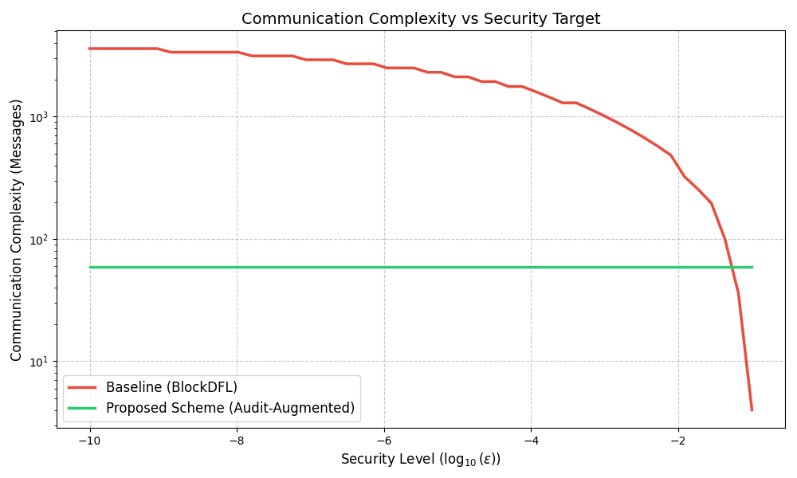

# 6.4 效率與可擴展性分析 (Efficiency and Scalability Analysis)

本節旨在量化比較本研究提出的「審計增強型架構 (Audit-Augmented Architecture)」與傳統「基於多數誠實假設 (Honest-Majority Based)」的 BCFL 系統（如 BlockDFL）在通訊開銷上的差異。我們採用「等安全條件下的成本分析 (Iso-assurance Cost Analysis)」，即在確保系統失效機率低於特定閾值 $\epsilon$ 的前提下，計算兩者所需的通訊複雜度。

## 6.4.1 通訊複雜度模型 (Communication Complexity Model)

假設系統中有 $N$ 個驗證節點，其中惡意節點佔比為 $f$。

### A. 基準方案 (Baseline: BlockDFL)
傳統方案依賴委員會內部的 BFT 共識來確保安全性。為了防止惡意節點控制委員會（即佔據超過 $1/3$ 或 $1/2$ 席位），必須擴大委員會規模 $C_{base}$。其單輪通訊複雜度為委員會內部廣播的開銷：
$$Cost_{base} = O(C_{base}^2)$$
其中 $C_{base}$ 是關於安全閾值 $\epsilon$ 和惡意佔比 $f$ 的函數：$C_{base} = \text{func}(\epsilon, f)$。

### B. 本研究方案 (Proposed Scheme)
本方案將安全性與委員會規模解耦。委員會 $C_{small}$ 僅負責活性（Liveness），安全性由異步挑戰機制保證。系統存在兩種狀態：正常執行（Happy Path）與爭議仲裁（Dispute Path）。設挑戰發生的機率為 $p$，則期望通訊複雜度 $E[Cost_{ours}]$ 為：
$$E[Cost_{ours}] = (1-p) \cdot O(C_{small}^2) + p \cdot (O(C_{small}^2) + O(N^2))$$
$$\approx O(C_{small}^2) + p \cdot O(N^2)$$
其中 $C_{small}$ 為常數（本實驗設為 7），$N$ 為全網節點數。

## 6.4.2 安全性與委員會規模的定量關係 (Quantitative Analysis of Security vs. Committee Size)

為了進行公平比較，我們必須計算基準方案在不同安全需求下所需的最小委員會規模。假設委員會選舉服從超幾何分佈 $H(N, M, C)$，其中 $M = \lfloor f \cdot N \rfloor$ 為惡意節點總數。系統失效（被攻陷）的定義為惡意節點在委員會中佔據多數（即 $k > C/2$）。失效機率 $P_{fail}$ 為：

$$P_{fail}(C) = \sum_{k=\lfloor C/2 \rfloor + 1}^{C} \frac{\binom{M}{k}\binom{N-M}{C-k}}{\binom{N}{C}}$$

我們設定 $N=100, f=0.3$，計算基準方案為了達到不同安全等級（即 $P_{fail} < \epsilon$）所需的最小 $C_{base}$。

### 表 6.2：等安全條件下的通訊複雜度比較 ($N=100, f=0.3$)
Table 6.2: Communication Complexity Comparison under Iso-assurance Conditions

| 安全目標 (Security Target, $\epsilon$) | 允許的失效機率 (Max Failure Prob.) | BlockDFL 所需委員會 ($C_{base}$) | 本方案委員會 ($C_{ours}$) | 效率提升倍率 (Speedup Factor) |
| :--- | :--- | :--- | :--- | :--- |
| **低安全性 (Low)** | $10^{-2}$ (1%) | 20 | 7 | **8.2x** |
| **中安全性 (Medium)** | $10^{-4}$ (0.01%) | 40 | 7 | **32.7x** |
| **高安全性 (High)** | $10^{-6}$ (0.0001%) | 52 | 7 | **55.2x** |
| **金融級安全 (Critical)** | $10^{-9}$ (1ppb) | 58 | 7 | **68.7x** |

> *註：BlockDFL 的複雜度以 $C^2$ 計算；本方案以 $C^2$ 計算（假設 $p \to 0$）。數據基於 $N=100, f=0.3$ 的超幾何分佈計算得出。*

如表 6.2 所示，傳統方案面臨嚴峻的安全性-效率權衡 (Security-Efficiency Trade-off)。若要將被攻陷的風險降至 $1\%$ 以下，BlockDFL 需要 $C=20$。若要求高安全性（失效機率百萬分之一），BlockDFL 必須動用超過半數節點 ($C=52$) 進行共識，其複雜度逼近 $O(N^2)$，這使得分片或委員會機制的優勢蕩然無存。相比之下，本方案通過引入經濟懲罰，使得 $C$ 固定為 7 即可滿足活性需求。在高安全性需求下，本方案展現出超過 50 倍的通訊效率提升。

*圖 6.4：不同安全需求下的通訊複雜度比較。本方案（綠線）在所有安全等級下均保持極低的通訊成本，而 BlockDFL（紅線）隨著安全要求的提高呈現近似指數級的成本增長。*

## 6.4.3 挑戰機率 $p$ 的博弈論邊界 (Game-Theoretic Bound of $p$)

上述分析假設了 $p \to 0$。本節論證這一假設的合理性。在理性攻擊者模型中，攻擊者發起攻擊的充要條件是預期收益大於 0：

$$E[\text{Attack}] = P_{success} \cdot G_{gain} - P_{detect} \cdot L_{slash} > 0$$

在本架構中：
1. **檢測必然性**：由於區塊鏈的公開透明性與異步審計機制，只要網路中存在至少 1 個誠實挑戰者，檢測機率 $P_{detect} \approx 1$。
2. **非對稱懲罰**：罰沒金額 $L_{slash}$ 設定為遠大於單次攻擊獲取的獎勵 $G_{gain}$（例如 $L_{slash} \ge 100 \cdot G_{gain}$）。

因此，對於理性攻擊者而言，攻擊的預期收益恆為負值 ($E < 0$)。這構成了一個納什均衡 (Nash Equilibrium)，即「誠實」是所有理性節點的主導策略。這意味著在系統穩定運行狀態下，挑戰事件將極少發生 ($p \approx 0$)。

即使考慮非理性惡意行為或軟體故障導致的誤觸發，只要 $p$ 保持在較低水平（例如 $p < 0.01$），本系統的加權平均複雜度仍遠低於全網共識。
$$E[Cost_{ours}] \approx O(7^2) + 0.01 \cdot O(100^2) = 49 + 100 = 149$$
$$Cost_{base(High Security)} \approx O(52^2) = 2704$$
即便在 1% 的極端挑戰率下，本方案仍保有約 18 倍 ($2704/149$) 的效率優勢。
